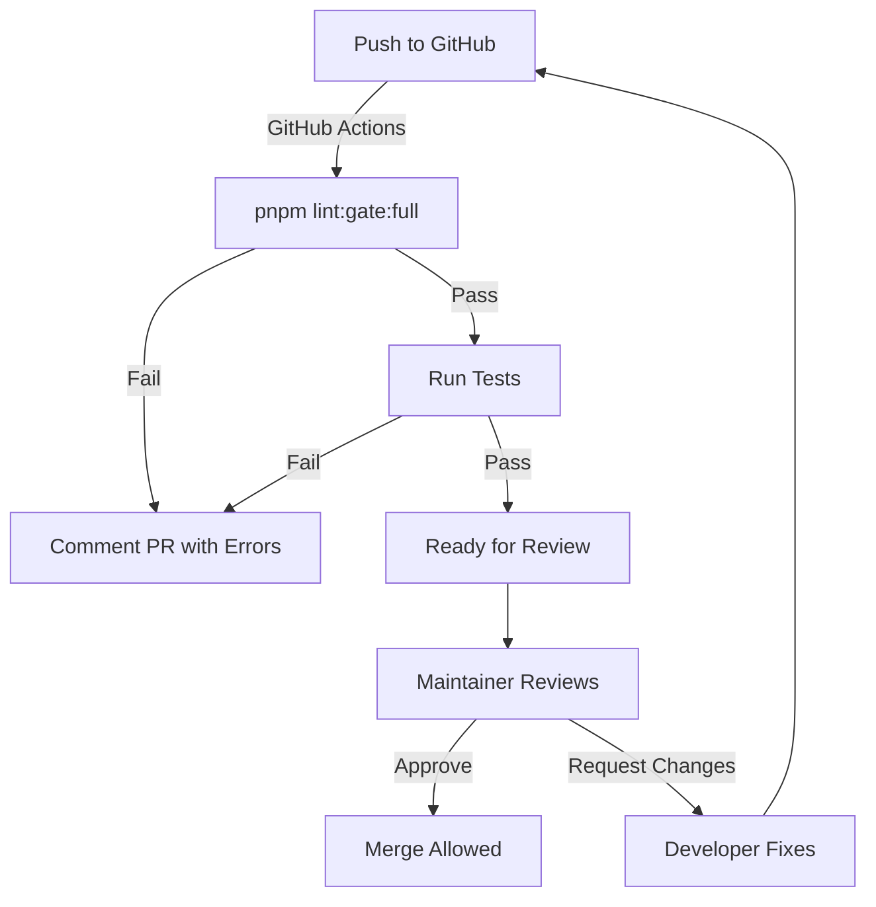

# Quality Gates Workflow Integration Guide

**Quick Reference**: How quality gates fit into your development workflow  
**Audience**: Developers, DevOps, Release Engineers  
**Updated**: 2026-03-19

---

## Quick Lookup Table

| Phase | Command | Duration | Exit If Failed? | Purpose |
|-------|---------|----------|-----------------|---------|
| 💻 **Writing Code** | `pnpm lint:gate:quick` | 5s | ✅ Yes | Catch bugs early |
| 📝 **Before Commit** | `pnpm lint:gate:standard` | 15s | ✅ Yes | Prevent bad commits |
| 🚀 **Before Push** | `pnpm lint:gate:standard` | 15s | ✅ Yes | Prevent bad pushes |
| 🔄 **PR/MR Validation** | `pnpm lint:gate:full` | 30s | ✅ Yes | Auto-validate PRs |
| 🎯 **Release Prep** | `pnpm lint:gate:strict` | 60s | ✅ Yes | Zero-tolerance check |
| 📦 **Production Deploy** | `pnpm lint:gate:strict` | 60s | ✅ Yes | Final safety net |

---

## Developer Workflow

### Day-to-Day Development

```
📝 Writing Code
    ↓
🔍 pnpm lint:gate:quick         ← Fast feedback (5s)
    │
    ├─ ✅ Pass? Continue coding
    └─ ❌ Fail? Fix issues
    ↓
git add .
git commit
    ↓
📋 pnpm lint:gate:standard      ← Pre-push check (15s)
    │
    ├─ ✅ Pass? Ready to push
    └─ ❌ Fail? Fix before pushing
    ↓
git push origin feature-branch
```

### Typical Session

```bash
# Morning: Start feature work
pnpm start                      # Dev server

# During work: Quick validation
pnpm lint:gate:quick            # Every few commits (~5s)

# Afternoon: Before pushing
pnpm lint:gate:standard         # Comprehensive check (~15s)
pnpm lint:fix                   # Auto-fix formatting
git push

# Evening: Check PR status
# GitHub Actions runs pnpm lint:gate:full automatically
```

---

## CI/CD Pipeline Integration

### Pull Request Workflow



### GitHub Actions Example

```yaml
name: Validate

on: [pull_request, push]

jobs:
  quality:
    runs-on: ubuntu-latest
    steps:
      - uses: actions/checkout@v3
      - uses: pnpm/action-setup@v2
      - uses: actions/setup-node@v3
        with:
          node-version: 24.14.1
          cache: pnpm
      
      - run: pnpm install
      
      # Full quality gate for CI/CD
      - name: CI Quality Gate
        run: pnpm lint:gate:full
        
      # Run tests
      - name: Tests
        run: pnpm test
```

---

## Release Workflow

### Pre-Release Checklist

```bash
# 1. Final validation
pnpm validate                   # Full project validation

# 2. Comprehensive linting
pnpm lint:gate:full             # All rule types

# 3. Release-level strictness
pnpm lint:gate:strict           # All rules + scopes ← REQUIRED
# Exit code must be 0

# 4. Build for production
pnpm build

# 5. Tag and deploy
git tag v1.2.3
npm publish
```

### Release Checklist Template

```markdown
## Release v1.2.3

- [ ] All PRs merged to main
- [ ] npm install fresh
- [ ] pnpm lint:gate:strict passes
- [ ] pnpm test passes
- [ ] pnpm build succeeds
- [ ] Changelog updated
- [ ] Version bumped in package.json
- [ ] git tag v1.2.3 created
- [ ] npm publish executed
- [ ] GitHub Release created
- [ ] Deploy to production confirmed
```

---

## When to Use Each Gate

### 🚀 QUICK Gate - "I'm developing"

**Scenarios**:
- ✅ First pass at implementing a feature
- ✅ Code is still in flux, not ready for push
- ✅ Want fast feedback to continue iterating
- ✅ Want to fail fast on critical issues

**NOT for**:
- ❌ Before pushing to GitHub
- ❌ Final pre-commit check
- ❌ Code review time
- ❌ CI/CD validation

**Typical Commands**:
```bash
pnpm lint:gate:quick          # Check for security + boundaries
pnpm lint:fix                  # Auto-fix common issues
# Continue coding...
```

---

### 📋 STANDARD Gate - "I'm ready to push"

**Scenarios**:
- ✅ Code is complete and tested locally
- ✅ Before `git push` to GitHub
- ✅ Before creating a pull request
- ✅ Normal development workflow

**NOT for**:
- ❌ During development (too slow, use Quick)
- ❌ Production deployment (use Strict)
- ❌ Automated CI/CD (use Full)

**Typical Commands**:
```bash
pnpm lint:gate:standard        # Normal checks
git push origin feature-branch
```

---

### 🔍 FULL Gate - "Automated validation"

**Scenarios**:
- ✅ Automated CI/CD pipeline validation
- ✅ Pull request automated checks
- ✅ Before automated merge
- ✅ Comprehensive but not architectural

**NOT for**:
- ❌ Local development (too slow)
- ❌ Pre-commit (too restrictive)
- ❌ Release deployment (use Strict)

**Typical Usage**:
```yaml
# GitHub Actions runs this automatically
- run: pnpm lint:gate:full
```

---

### 🎯 STRICT Gate - "Production release"

**Scenarios**:
- ✅ Final pre-release validation
- ✅ Before npm publish
- ✅ Before deploying to production
- ✅ Release branch validation
- ✅ Zero-tolerance validation

**NOT for**:
- ❌ Local development (way too slow)
- ❌ Pre-push (architectural checks overkill)
- ❌ Normal CI/CD (use Full instead)

**Typical Commands**:
```bash
# Release checklist
pnpm validate
pnpm lint:gate:strict          # REQUIRED for release
git tag v1.0.0
npm publish
```

---

## Team Workflow Recommendations

### For Individual Developers

```bash
# Per feature
pnpm lint:gate:quick           # During development
pnpm lint:gate:standard        # Before pushing

# Per PR/MR
# Automated: GitHub Actions runs lint:gate:full
```

### For Team Leads / Code Reviewers

```bash
# Validate PR quality
pnpm lint:gate:full            # All rule types passed

# Before approving
pnpm lint:gate:standard        # Standard gate still passes

# Before merge to main
# (CI/CD should already have run lint:gate:full)
```

### For DevOps / Release Engineers

```bash
# Before staging
pnpm lint:gate:full            # PR-level passed

# Before production
pnpm lint:gate:strict          # Release-level passed
# All scopes validated
```

---

## Exit Code Reference

### Command Status Codes

| Code | Meaning | Action |
|------|---------|--------|
| `0` | ✅ All checks passed | Safe to proceed to next phase |
| `1` | ❌ One or more checks failed | Review error output, fix, re-run |
| `2` | Invalid usage | Check command syntax |

### Scripting Usage

```bash
# Check exit code
pnpm lint:gate:quick
if [ $? -eq 0 ]; then
    echo "✅ Quality gate passed"
    git commit -m "Feature: ..."
else
    echo "❌ Quality gate failed - fix errors and retry"
    exit 1
fi
```

---

## Performance Targets

| Gate | Target | Typical | Max Acceptable |
|------|--------|---------|---|
| Quick | 5s | 3-7s | 10s |
| Standard | 15s | 10-20s | 30s |
| Full | 30s | 20-40s | 60s |
| Strict | 60s | 45-90s | 120s |

**If exceeding max**: ESLint config might be too expensive, check:
- Number of rules enabled
- Plugin complexity
- Codebase size
- System performance

---

## Common Patterns

### Pattern 1: Local Development

```bash
# Every 5-10 minutes during coding
pnpm lint:gate:quick

# Before ending work day
pnpm lint:gate:standard
pnpm lint:fix
git push
```

### Pattern 2: Feature Branch

```bash
# Create feature branch
git checkout -b feature/cool-thing

# Work...
pnpm lint:gate:quick      # Frequent checks
pnpm lint:fix             # Auto-fixes

# Ready to share
pnpm lint:gate:standard   # Final pre-push
git push origin feature/cool-thing
```

### Pattern 3: Code Review

```bash
# Reviewer validates
pnpm lint:gate:full
# ✅ Passes? Ready to merge
# ❌ Fails? Comment on PR with lint output
```

### Pattern 4: Release

```bash
# Prepare for release
git checkout main
git pull
pnpm install

# Release validations
pnpm validate              # All tests pass
pnpm lint:gate:strict      # Zero-tolerance check
# ✅ Both pass? Safe to release

git tag v1.0.0
npm publish
```

---

## Troubleshooting Workflow

### "PRs getting blocked on CI/CD"

Run locally before pushing:
```bash
pnpm lint:fix              # Auto-fix first
pnpm lint:gate:standard    # Verify fixes
git push                   # Safe now
```

### "Developers committing broken code"

Add pre-commit hook:
```bash
# .husky/pre-commit
#!/bin/sh
pnpm lint:gate:quick || exit 1
```

### "Releases taking too long"

Consider parallelization:
```bash
# Run gates in parallel (if supported)
pnpm lint:gate:full &
pnpm test &
wait
```

### "False positives in tests"

Review ESLint config:
```bash
# See what's failing
pnpm lint:gate:full        # Full detailed output
# Adjust rules as needed
```

---

## Integration Points

### Pre-commit Hook (Optional)

```bash
# .husky/pre-commit
#!/bin/sh
. "$(dirname "$0")/_/husky.sh"

echo "🚀 Running Quick Quality Gate..."
pnpm lint:gate:quick || exit 1

echo "✅ Pre-commit validation passed"
```

### Pre-push Hook (Optional)

```bash
# .husky/pre-push
#!/bin/sh
. "$(dirname "$0")/_/husky.sh"

echo "📋 Running Standard Quality Gate..."
pnpm lint:gate:standard || exit 1

echo "✅ Pre-push validation passed"
```

### GitHub Actions (Required for Teams)

```yaml
# .github/workflows/lint.yml
on: [pull_request, push]
jobs:
  quality:
    runs-on: ubuntu-latest
    steps:
      - uses: actions/checkout@v3
      - uses: pnpm/action-setup@v2
      - uses: actions/setup-node@v3
        with:
          node-version: 24.14.1
          cache: pnpm
      - run: pnpm install
      - run: pnpm lint:gate:full
```

---

## Summary

- **Quick** → Fast, frequent, during development (~5s)
- **Standard** → Normal, before push (~15s)
- **Full** → Comprehensive, automated CI/CD (~30s)
- **Strict** → Zero-tolerance, release only (~60s)

**Golden Rule**: Run **Standard** before pushing, let **Full** run automatically on PR.

